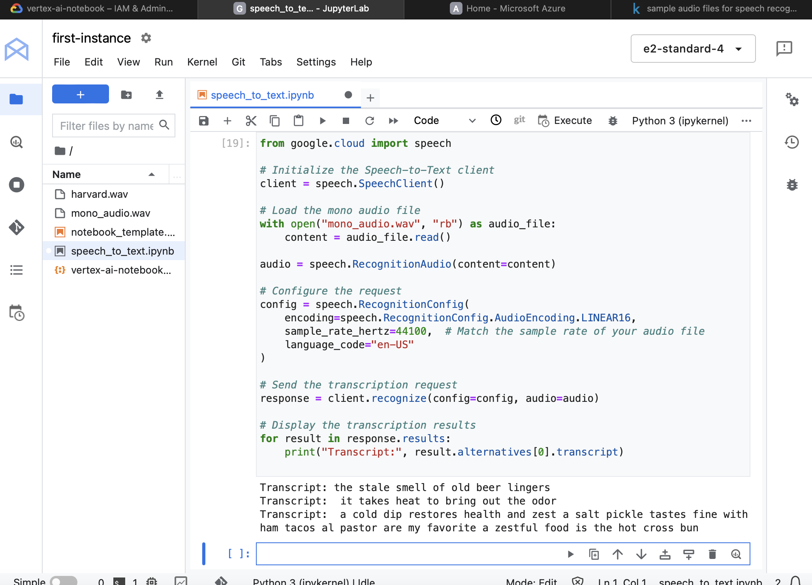
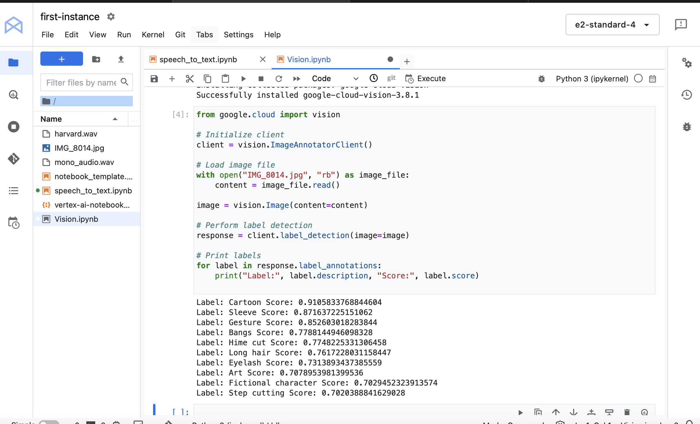
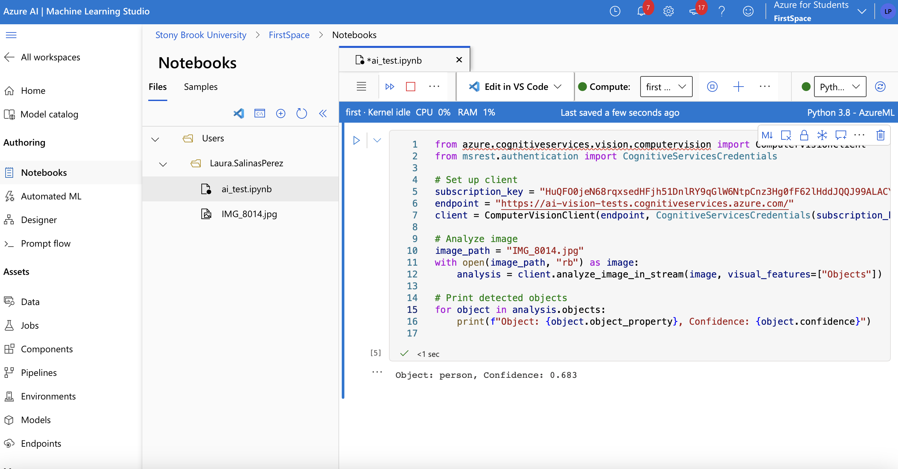

# HHA504 Assignment: AI Model Interactions

## 1. Speech-to-Text with GCP
### Steps Taken
- Enabled GCP Speech-to-Text API.
- Uploaded sample audio file and transcribed it using the API.

### Results

---

## 2. Vision Models
### GCP Vision API
#### Steps Taken
- Enabled GCP Vision API.
- Uploaded an image for label detection.

#### Results

---

### Azure AI Vision
#### Steps Taken
- Used Azure AI Vision to analyze the same image for object detection.

#### Results

---

## 3. Comparison and Reflection
### GCP vs Azure
| Feature            | GCP                        | Azure                      |
|--------------------|----------------------------|----------------------------|
| **Ease of Setup**  | Straightforward setup      | Slightly more complex      |
| **Model Accuracy** | High accuracy for objects | Comparable results         |
| **Ease of Use**    | Friendly API documentation | Comprehensive but verbose  |

### Challenges
- **GCP**: Adjusting sample rates for audio files in Speech-to-Text API.
- **Azure**: Understanding and setting up the subscription key.

### Reflections
- GCP was slightly easier to set up for speech tasks.
- Both platforms provided accurate results for vision tasks, but Azure's documentation felt more detailed.
